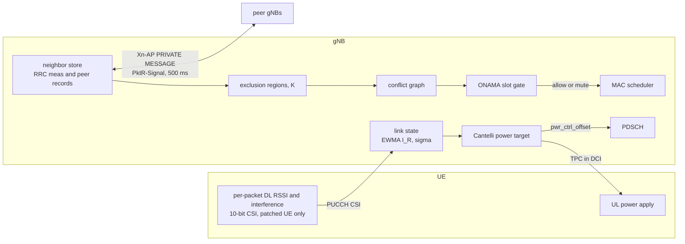

# Architecture and code map

This page explains how KaiAir is put together and where it lives in the OCUDU and OAI
trees. Every KaiAir change in an upstream file carries an inline `KaiAir` or `KaiAir/PktR`
comment, so running `grep -rn "KaiAir"` over a patched tree enumerates the full footprint.

## The design in one paragraph

Each gNB keeps per-link statistics, the interference mean and variance and the per-packet
SINR. For every packet it computes the transmission power that satisfies
`Pr{SINR >= gamma} >= beta` through the one-sided Cantelli bound,
`P_T = G + I_R + gamma + sigma * sqrt(beta/(1-beta))`. The UL actuator is the standard
closed-loop TPC command in DCI, which any UE obeys. The DL actuator is the per-PDSCH
power offset inside the gNB, so no UE support is needed there either. For multi-cell
operation, each gNB sizes a receiver-centric exclusion region per link from the same
budget, `E_max = S - gamma - sigma*k`. It learns cross-cell gains from neighbor-cell RSRP
reports through TDD reciprocity, exchanges its link records with peer gNBs over Xn,
builds a conflict graph, and gates its own scheduler with ONAMA. A deterministic hash of
the global slot index and the link id picks one winner per conflicting pair per slot,
with no per-slot message exchange. The heavy work runs on the metrics tick. The scheduler
slot path only does table lookups.

## gNB side (OCUDU)

### Core modules, all new files

The algorithm logic is header-only under `lib/scheduler/kaiair/`, kept free of scheduler
dependencies so each piece unit-tests in isolation.

| File | Contents |
|---|---|
| `pktr_ipc.h` | Cantelli power target, tolerable-interference budget `E_max[I_R]`, sigma factor `k(beta)` |
| `pktr_link_state.h` | per-link EWMA interference mean and variance, per-packet SINR statistics, regime-transition detection |
| `pktr_grk.h` | GRK interference model, exclusion-region sizing, K-adaptation |
| `pktr_signal_map.h` | in-cell and cross-cell gain map, built from PHR and RSRP |
| `pktr_dl_power_controller.h` | the DL closed loop, with a HARQ-BLER mode and a true-SINR mode, offset slewing, full-power-equivalent statistics |
| `pktr_ldp.h` | LDP arithmetic, `X = ceil(log_{1-p}(1-P))`, the retransmission budget, deadline conversion (experimental) |
| `pktr_runtime_config.h` | env knobs and the live control-file overlay (gamma, power on and off, gate mode, LDP deadline, re-read at runtime), UL cushion gates |
| `pktr_conflict_graph.h` | link records, the PRKS conflict predicate, conflict sets, the ONAMA slot-contention set |
| `pktr_er_controller.h` | the per-tick controller. Builds DL and UL victim links, ingests peer records, computes ER, K and conflicts, publishes ONAMA masks |
| `pktr_slot_gate.h` | the ONAMA priority hash, per-link activity masks, the global slot index from the PTP wall clock |
| `pktr_gate_table.h` | lock-free mask table the scheduler consults per slot |

Shared headers in `include/ocudu/kaiair/`.

| File | Contents |
|---|---|
| `pktr_neighbor_store.h` | per-UE serving and neighbor RSRP store, fed from CU-CP measurement reports and peer records |
| `pktr_xn_signal.h` | the PktR-Signal record wire format (cell row, per-link rows, rx-power rows, UL link rows) |

The Xn carrier is `include/ocudu/asn1/xnap/kaiair_private_ies.h`, which supplies the
private-IE container for the TS 38.423 PRIVATE MESSAGE (the generated ASN.1 ships an
empty set). Two one-line touches in `xnap_pdu_contents.h` wire it in.

### Integration points, modified upstream files

| Area | File | What changed |
|---|---|---|
| UL power loop | `lib/scheduler/support/pusch_power_controller.{h,cpp}` | the live gamma overlay replaces the static target, and the Cantelli cushion is added to the TPC comparison |
| UL cushion input | `lib/scheduler/ue_scheduling/ue_cell_grid_allocator.cpp` | per-grant cushion from the link state, and the DL per-UE power offset applied to PDSCH |
| Link state feed | `lib/scheduler/ue_context/ue_cell.{h,cpp}`, `ue_event_manager.cpp` | per-CRC UL SINR and RSRP into the link state, DL delivery classification |
| DL feedback | `lib/mac/mac_sched/uci_cell_decoder.cpp`, `lib/ran/csi_report/csi_report_on_pucch_helpers.cpp`, `lib/scheduler/uci_scheduling/uci_indication_selector.*` | 10-bit true-SINR CSI decode (whole-payload bit reversal) and a synthesized CQI so MCS adaptation keeps working |
| HARQ and LDP | `lib/scheduler/cell/cell_harq_manager.{h,cpp}`, `lib/scheduler/ue_scheduling/intra_slice_scheduler.cpp` | first-transmission timestamps, deadline abandonment, the retransmission cap, urgency ordering (experimental) |
| ONAMA gate hooks | `intra_slice_scheduler.cpp` (`can_allocate_pdsch`, `can_allocate_pusch`) | mask lookup, fail-open outside the window |
| Neighbor measurements | `lib/cu_cp/cell_meas_manager/cell_meas_manager_impl.cpp` | measurement reports into the neighbor store, keyed by serving PCI |
| Xn exchange | `lib/xnap/xnap_impl.{h,cpp}` | PktR-Signal publish every 500 ms per association, ingest of peer records |
| Telemetry | `lib/scheduler/logging/scheduler_metrics_handler.*`, `apps/.../kaiair_pktr_metrics_view.{h,cpp}` | per-link JSON writer, the console feedback view, the per-tick controller invocation |
| Radio | `lib/radio/uhd/radio_uhd_impl.cpp` | a GPSDO whose `gps_locked` sensor cannot be read is no longer fatal, and `KAIAIR_REQUIRE_GPS_LOCK` restores strict behavior |

### Tests

Twelve gtest suites under `tests/unittests/scheduler/kaiair/`. They cover the IPC math,
the link state, GRK, the signal map, the DL controller, the LDP arithmetic, the runtime
config, the neighbor store, the conflict graph, the slot gate (including cross-cell
agreement and a counter-wrap regression), UL exclusion regions, and the Xn record round
trip. `ctest -R pktr` runs them all.

## UE side (OAI nrUE, optional reference arm)

The patched UE does two things. It applies the network-computed UL power in the digital
domain, so power control is exact rather than TPC-quantized. And it measures the DL the
way the underlying dissertation specifies, RSSI over the scheduled PDSCH data REs and
interference over unused RBs, reporting both in a compact 10-bit CSI on PUCCH.

| File | What changed |
|---|---|
| `openair1/PHY/NR_UE_TRANSPORT/nr_ulsch_ue.c` | UL power apply. Scales the PUSCH amplitude with data, DMRS and PT-RS kept coherent, with a bounded backoff depth (`KAIAIR_UL_PWR_MIN_DB`) so deep digital scaling cannot sink the signal under the transmitter's own noise floor |
| `openair1/PHY/NR_UE_TRANSPORT/nr_dlsch_demodulation.c` | per-slot PDSCH data RSSI and unused-RB interference measurement, C-RNTI only, since broadcast PDSCH is sent at full power and would blind the loop |
| `openair1/PHY/NR_UE_TRANSPORT/csi_rx.c`, `openair1/PHY/NR_UE_ESTIMATION/nr_ue_measurements.c` | measurement plumbing |
| `openair2/LAYER2/NR_MAC_UE/nr_ue_procedures.c`, `nr_ue_scheduler.c`, `nr_mac_common.c`, `mac_defs.h`, `mac_proto.h` | the 10-bit CSI payload build (bit-reversed to match the PUCCH chain) and neighbor-cell measurement handling |
| `openair2/LAYER2/NR_MAC_UE/nr_ue_power_procedures.c` | the power computation handed to the PHY apply path |
| `nfapi/.../fapi_nr_ue_interface.h` | carries transmit power and P_CMAX to the PHY |

The UE also received two robustness fixes needed for multi-cell work. The neighbor-cell
PSS search scans a full frame until first acquisition and then uses a tracking window,
and corrupt foreign-cell DCI is tolerated instead of ending in an assertion exit.

## What runs where, timing-wise

- The slot path (2 kHz) does a mask table lookup and a cushion addition. Constant time,
  no allocation.
- The metrics tick (1 Hz) does link-state consolidation, the exclusion-region controller
  (regions, conflict graph, ONAMA masks for a 2 s look-ahead window), the telemetry JSON,
  and the Xn record refresh.
- Xn publishes the PktR-Signal every 500 ms per association and ingests peer records.
- The control overlay is re-read on the tick. Gamma, power on and off, the gate mode and
  the LDP deadline all change live, without restarting anything.

## Multi-cell timing model

The radios take 10 MHz and PPS from a shared reference, which aligns TDD slot boundaries.
Slot indexing is the separate problem ONAMA cares about. Every cell must call the same
physical slot by the same number. KaiAir derives the global index from the
PTP-disciplined host clock (`wall_ns / slot_duration`), freshly on every tick. The local
slot counter wraps every 10.24 s and must never be trusted as a long-term reference. Two
cells agree on the winner of every slot as long as their host clocks agree to well under
one slot of 500 us. PTP with hardware timestamps achieves tens of microseconds.
